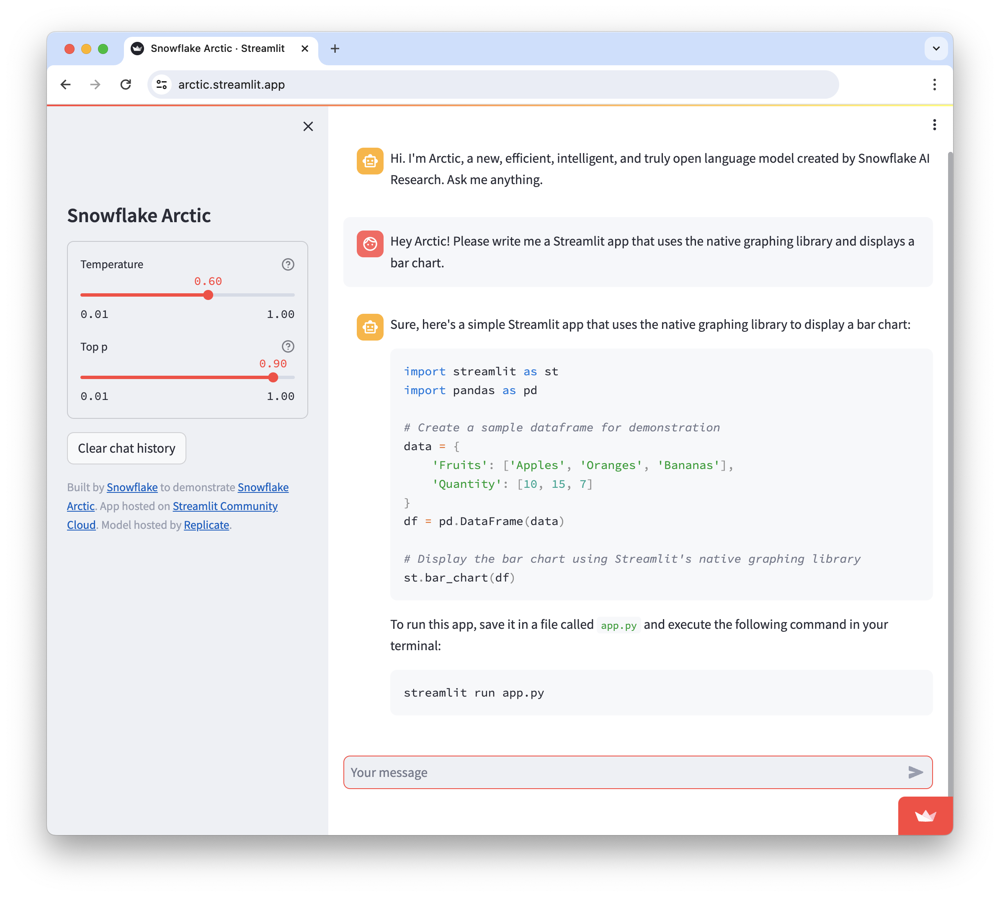

# 🤖❄️ Snowflake Arctic Chatbot
This Streamlit app is not just any chatbot; it's your starter kit to play with Snowflake's brand new foundation model: Snowflake Arctic! Arctic was released on April 24, 2024 and is completely open-source 😍

Get the full lowdown on Arctic in Adrien Treuille's [blog post](http://blog.streamlit.io/introducing-snowflake-arctic/). Snowflake Arctic is also available via [Hugging Face](https://huggingface.co/Snowflake/snowflake-arctic-instruct) 🤗 and all your favorite model gardens soon! 🔜

Built a cool Streamlit app using Arctic? Share it on social media with #SnowflakeArctic! We'll repost you 🫡



## Getting your own Replicate API token

To use this app, you'll need to get your own [Replicate](https://replicate.com/) API token.

After creating a Replicate account, you can access your API token from [this page](https://replicate.com/account/api-tokens).

## Setup Instructions

### Prerequisites
- Python 3.8 or later 🐍
- pip3 📦

### Installation
1. **Clone this repository**
   ```bash
   git clone https://github.com/yourusername/snowflake-arctic-chatbot.git
   cd snowflake-arctic-chatbot
   ```

2. **Install requirements**
   ```bash
      pip install -r requirements.txt
   ```

3. **Add your API token to your secrets file**\
Create a `.streamlit` folder with a `secrets.toml` file inside.
   ```bash
   mkdir .streamlit
   cd .streamlit
   touch secrets.toml
   ```
   
   Use your text editor or IDE of choice to add the following to `secrets.toml`:
      ```toml
      REPLICATE_API_TOKEN = "your API token here"
      ```
   Learn more about Streamlit secrets management in [our docs](https://docs.streamlit.io/deploy/streamlit-community-cloud/deploy-your-app/secrets-management).
   
   Alternatively, you can enter your Replicate API token via the `st.text_input` widget in the app itself (once you're running the app).

4. **Run the Streamlit app**
Note: there are two versions of the app included in this repo. `simple_app.py` is a simpler app which passes user input to Arctic and returns Arctic's response. `streamlit_app.py` has built-in guardrails, meaning that it checks user input to ensure queries are safe (i.e. users are not asking Arctic for instructions on how to commit illegal activity, etc.).

To run the version of the app that includes guardrails, enter:
   ```bash
   cd ..
   streamlit run streamlit_app.py
   ```

To run the simpler version of the app, enter:
   ```bash
   cd ..
   streamlit run simple_app.py
   ```

### Deployment
Host your app for free on Streamlit Community Cloud. These instructions are also available in [our docs](https://docs.streamlit.io/deploy/streamlit-community-cloud/deploy-your-app).

1. Sign up for a Community Cloud account or log in at [share.streamlit.io](https://share.streamlit.io/).
2. Click "New app" from the upper-right corner of your workspace.
3. Fill in your repo, branch, and file path. As a shortcut, you can also click "Paste GitHub URL" to paste a link directly to `streamlit_app.py` on GitHub.  

#### Optional: store your Replicate API token with Community Cloud secrets
Securely store your Replicate API token with Community Cloud's secrets management feature. These instructions are also available in [our docs](https://docs.streamlit.io/deploy/streamlit-community-cloud/deploy-your-app/secrets-management).
   
##### Add secrets before deploying
1. Before clicking "Deploy", click "Advanced settings..."  
2. A modal will appear with an input box for your secrets.   
3. Provide your secrets in the "Secrets" field using TOML format. For example:
   ```toml
   REPLICATE_API_TOKEN = "your API token here"
   ```
   
##### Add secrets after deploying
1. Go to [share.streamlit.io](https://share.streamlit.io/).
2. Click the overflow menu icon (AKA hamburger icon) for your app.
3. Click "Settings".  
4. A modal will appear. Click "Secrets" on the left.  
5. After you edit your secrets, click "Save". It might take a minute for the update to be propagated to your app, but the new values will be reflected when the app re-runs.
   
### Support
Need help? Got a burning question or a spark of genius to share? Just open an issue in this repository.
